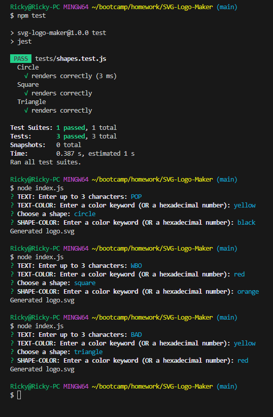

# SVG Logo Maker

## Description
This SVG Logo Maker was developed using NodeJS, JSON, and Inquirer.
## Table of Contents
* [Usage](#usage)
* [Contact-Me](#contact)
* [Contributors](#contributors)
* [Testing](#testing)
* [Demo](#demo)

* [License](#license)

## Usage
The user will be able to generate a logo by running NodeJS in the terminal with index.js. They will be prompted with several questions about the design of the logo. Once completed a logo will be generated as "logo.svg." You can also run npm test in the command line to test the code.

The following image shows the command-line application's appearance and functionality:

## Contact
* Name - Ricardo Scuotto
* Email - ucfscuotto@gmail.com
* Github - [Ricky-Sama](https://github.com/Ricky-Sama/)
## Contributors
N/A
## Testing
The application was designed with Jest to run files in the tests folder.

## Demo
<a href="https://drive.google.com/file/d/1mtIn_OpXQizsn5ZZrZIhvMgZ4voTaQo5/view">Logo Maker Demonstration</a>
## License

        Licensed under the MIT license.